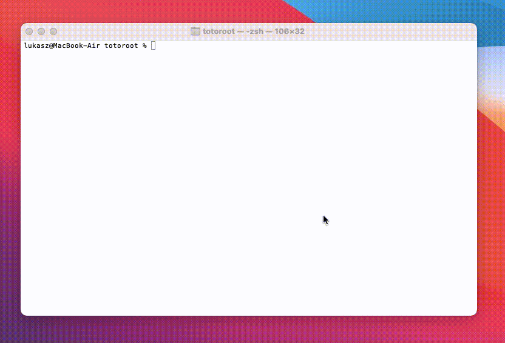

# totoroot
 Totolink N200RE remote root exploit.

## Disclaimer
 I know that the code isn't perfect. Please don't learn from it or better don't read it at all.

## Supported devices
 Totolink N200RE-V3 Mini and probably other Totolink devices vulnerable to CVE-2019-19822, CVE-2019-19824 and related.

## How to use
```
curl https://raw.githubusercontent.com/lkkula/totoroot/main/totoroot.py -o totoroot.py
chmod u+x totoroot.py
./totoroot.py <target IP>
```

## Demo
